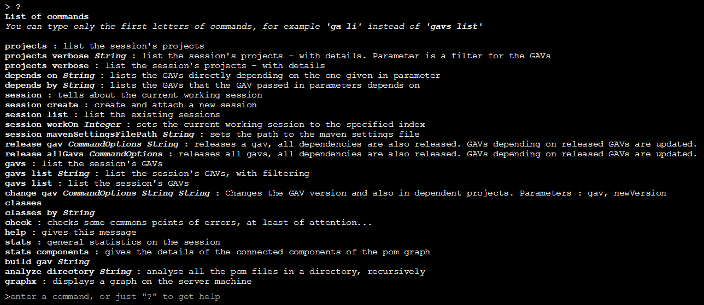
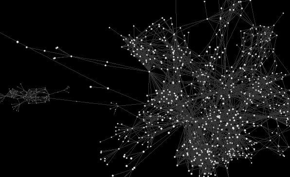
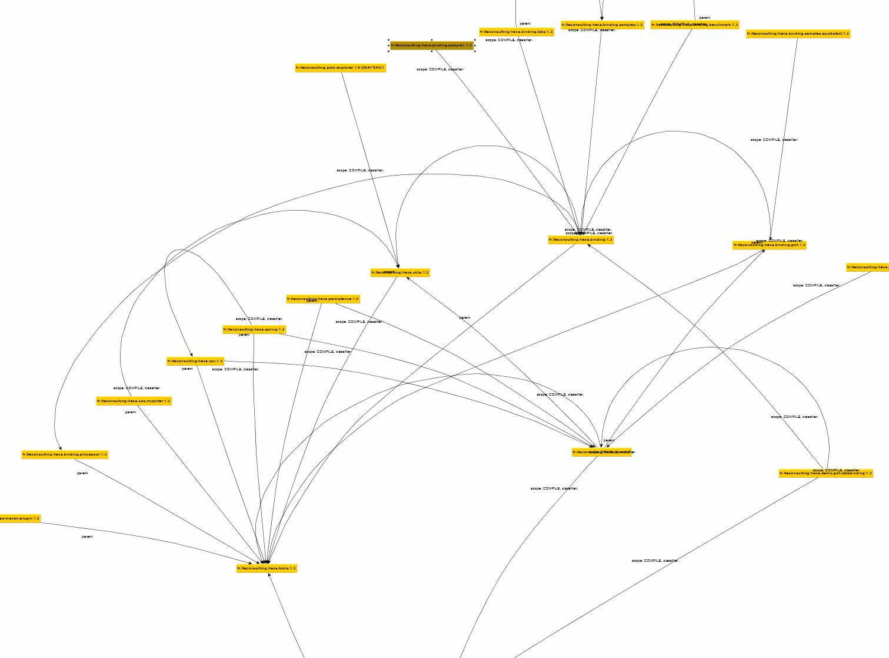

# pom-explorer

The Maven's swiss knife

## Description

When a team writes a lot of maven projects, it is painful to manage versionning and connections between them. This tool helps you to update you pom graph easily.

It has several objectives:

- help mind-mapping a big pom graph,
- applying transformations on the pom graph,
- help to detect errors and inconsistencies in a pom graph.
- when the first objectives are implemented, the tool will also support automatically building projects which need to be build when source files are updated, in order to always have such or such project always available.

Main functions :

- release a graph : release a pom or all poms and its/theirs dependencies and updates all dependent poms.
- change a gav : updates a project's gav and make all the project which depends on it follow this change.
- manages properties, dependency management, and so on. Pom-explorer knows what pom.xml to update and where to update it. If a dependency specifies `<version>${foobar.version}</version>`, pom-explorer will go to update the `foobar.version` property...
- statistics and check functions are also available...
- displays 3d interactive graph
- exports graphml files
- find not used dependencies

This project is in active development and serves also as a platform to work on useful use cases that can manifest. It is used to manage the versions, connections and dependencies of 43 projects. If you have ideas or anything like that, don't hesitate to write a pull request.

This project is certainly not production ready nor really user-friendly. That's because the functionality set is not well defined yet. So any feature you need related to your pom dependency graph could be added in the feature list and will maybe impact the final architecture. So that is certainly the moment for you to say what you need in this project ! 

## Build and run

To build :

	mvn install

To run :

	java -jar target/pom-explorer.jar
	
Then go with your browser on this address

	http://localhost:90

This is the console to the application. You can type commands in the prompt, they will be sent to the server and it will answer.

Let's start by typing `?` to get the available commands :

## Analysing maven projects

*If you use a specific maven configuration file, you can specify it prior to the next commands with the `session mavenSettingsFilePath String` command.*

First, you will want to analyse some projects. Depending on where they are on your computer, you can type something like this in the application console/web page :

	analyse directory c:\documents\repos

The program will analyse the directory recursively to find all the `pom.xml` files. They are then processed with the traditionnal `MavenXpp3Reader` and also resolved through the `ShrinkWrap` component. A graph is then constructed in memory representing the dependencies between projects.

If you need, you can add more analyses by repeating the `analyse directory` command again on another directory.

## Basic commands

Let's have a look at the GAVs (groupId/artifactId/version) that are registered in the graph :

	gav list

Here's an example of a result :

## Visualization of the dependency graph

### 3D live graph

It is possible to visualize dynamically the graph dependency. The graph is using WebGL and allows to walk in the 3D space with the W, S, A, D, Q and E keys. It is using the VivaGraph and NGraph libraries.

You can enter the `graph` command :

	> graph
	To display the graph, go to : graph.html?session=1441798206

Then click on the given link to see the graph for your current session.

#### The graph window

In the main part, you can navigate with W,A,S,D,E,A and the arrow keys. On the right side, you can edit javascript filters and customizers for node and links.

### GraphML export

You can export a graphml file with the `graph export` command. This will create a .graphml file in the current directory.

You can then use this file with an editor like yEd... This will give you something like that for instance :

## Finding useless dependencies

After a long time of development, your projects might include dependencies that are not needed anymore. However, chasing those obsolete dependencies can be a long task because of the number of dependencies to analyze. Moreover, it is error prone to do it by hand.

Pom Explorer finds those dependencies for you. How does it do that ? There are X phases when searching useless declared dependencies in a project :

- first, find all the project's dependencies (including transitive when needed or possible),
- build a set of all java classes provided by each of those dependencies,
- parse all the java files of the analyzed project,
- analyze data to bring up pertinent alerts.

To analyze dependencies which are not needed by a project, use the `garbage dependencies gavFilter` command. for example :

	garbage dependencies fr.lteconsulting:carousel:1.0-SNAPSHOT

This will launch the analyze. When finished, the results will be displayed :

	Considered project's dependencies:
	com.google.code.gson:gson:2.3.1
	io.undertow:undertow-servlet:1.2.6.Final
	junit:junit:3.8.1
	org.imgscalr:imgscalr-lib:4.2
	
	Java classes provided by gav com.google.code.gson:gson:2.3.1 :
	resolved file : C:\Users\Arnaud\.m2\repository\com\google\code\gson\gson\2.3.1\gson-2.3.1.jar
	165 provided classes, use -v option to display them
	
	Java classes provided by gav org.imgscalr:imgscalr-lib:4.2 :
	resolved file : C:\Users\Arnaud\.m2\repository\org\imgscalr\imgscalr-lib\4.2\imgscalr-lib-4.2.jar
	22 provided classes, use -v option to display them
	
	Java classes provided by gav io.undertow:undertow-servlet:1.2.6.Final :
	resolved file : C:\Users\Arnaud\.m2\repository\io\undertow\undertow-servlet\1.2.6.Final\undertow-servlet-1.2.6.Final.jar
	244 provided classes, use -v option to display them
	
	Java classes provided by gav junit:junit:3.8.1 :
	resolved file : C:\Users\Arnaud\.m2\repository\junit\junit\3.8.1\junit-3.8.1.jar
	100 provided classes, use -v option to display them
	
	Java classes provided by gav fr.lteconsulting:carousel:1.0-SNAPSHOT :
	resolved file : C:\Users\Arnaud\.m2\repository\fr\lteconsulting\carousel\1.0-SNAPSHOT\carousel-1.0-SNAPSHOT.jar
	
	Analyzing referenced fqns of the project 'C:\documents\repos\carousel\pom.xml'
	Use the -v option to display the list of referenced fqns.
	processing parsing java directory : C:\documents\repos\carousel\src
	warning : the analyzed fqns may contain false positives, because the java parsing is not fine tuned yet.
	Also it does not detect references made to inner classes (that can be fixed) and through reflection (cannot be fixed), like Class.forName(...) calls.
	Feel free to submit a pull request !
	finished : 18 directories traversed, 7 java files parsed
	
	
	Referenced FQNs without a provider (may include false positives, or internally defined fqns):
	5 not provided references found
	FileChannel.MapMode
	FileChannel.MapMode.READ_ONLY
	com.google.gwt.dom.client.Element
	com.google.gwt.user.client.DOM
	fr.lteconsulting.tarditest.client.templates.TemplateRuntime
	
	GAV declared in project's hierarchy dependencies but not referenced in the project's sources (may include false positives like imported or module poms):
	0 declared but not used GAVs
	
	Referenced FQNs from transitive dependencies :
	0 referenced transitive dependencies GAV
	
	GAV declared directly in the project's dependencies but not referenced in the project's sources (may include false positives like imported or module poms):
	3 declared but not used GAVs
	com.google.code.gson:gson:2.3.1 (provides 165 classes)
	io.undertow:undertow-servlet:1.2.6.Final (provides 244 classes)
	org.imgscalr:imgscalr-lib:4.2 (provides 22 classes)

Section by section, here is what is displayed :

### Analyzed dependencies

`Considered project's dependencies` section lists all the dependencies of the project which will be inspected (to find java classes that they provide).

### Dependencies analysis

Then each dependency is analyzed and the corresponding resolved jar file path is displayed, together with the number of classes that are provided by this dependency. You can add the `-v` flag to get the detail of those classes.

### Referenced FQNs analysis

Then all the java source files of the analyzed project are parsed to find which fqn they reference. Again the `-v` option will list the detail of those classes.

### Not found FQNs

Then a section displays the referenced FQNs without a provider. That means the fqns that were found to be referenced in the analyzed project but for which the program did not find a dependency providing this fqn. *Note that false positive can happen ! First fqn references might not reference a real class fqn, like here where FileChannel.MapMode.READ_ONLY is an enum value. Secondly, the referenced fqn might be defined in a transitive dependency of an external library, which has not been added to the dependency graph. There is a command that should be developped to solve this problem.*

### Useless hierarchy dependencies

The next section displays the GAV of the dependencies from the project's hierarchy (parent poms) which are not referenced in the project's source files. This may not necessaryly mean that those dependencies should be removed, as they could be used by other projects. However, it can be a good idea to look at them.

### Referenced transitive dependencies

Next are the classes that are referenced but which are provided by a transitive dependency which is not directly depended on. That's a bad practice, that's why the section is here.

### Useless dependencies

The last section displays the dependencies that are declared in the project's pom.xml file but which are not referenced in the java source code. Those dependencies should be looked at and one should decide whether to remove them or not, as there can be false positives. In the example, the `gson` dependency is really not needed. The `undertow-servlet` dependency is not needed, but after investigation you find that the `undertow-core` (which is transitive to `undertow-servlet`) is used because it provides the `FileChannel.MapMode` class, which was in the list of not found classes. Sometimes, you can also see dependency to jdbc drivers because they are used through a `Class.forName(...)` call.

## Analysing dependencies

... Documentation to be written ...

## Manipulating the pom graph

...

## Other commands

...

### Changing a GAV

...

### Releasing 

...

## Other

...

### Default script

There is a default script that can be executed when a new client connects. If a file called `welcome.commands` exists in the working directory, it will be read and executed. An example file already exists in the repository.

### Default configuration

If a `config.properties` file is found in the working directory it is used to configure sessions when created. Here is the list of the possible flags :

- **defaultMavenSettingsFile** : if you want to use a specific Maven configuration file, you can set its path here.

## Roadmap / Todo list

### Questions the program should answer

- in a project, which are declared dependency management which are not used in a dependency ?
- where is defined such property, available in such project ?

### Functionalities

- find where dependencies override demendency management
- user wants the project X to be always build with latest dependencies. If code is modified in a depended project, required projects should be rebuilt.
- resolve all projects from external dependencies -> download files and add them in the graph, until the last one !

### Graph functionalities

- aggregate pom nodes (those with same G & A but different versions, classifiers or scopes)
- go to a specific pom
- show multiple roads from one pom to another
