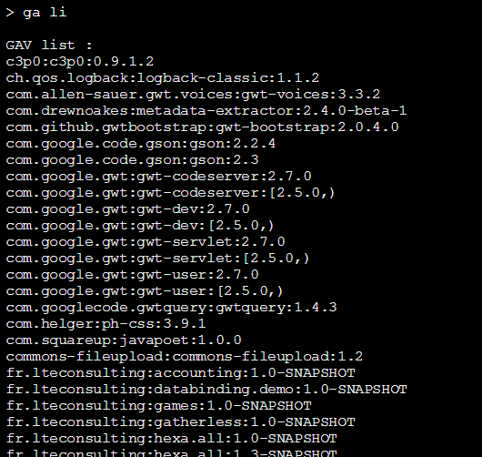

# pom-explorer

The Maven's swiss knife

## Description

When a team writes a lot of maven projects, it is painful to manage versionning and connections between them. This tool helps you to update you pom graph easily.

It has several objectives:

- help mind-mapping a big pom graph,
- applying transformations on the pom graph,
- help to detect errors and inconsistencies in a pom graph.
- when the first objectives are implemented, the tool will also support automatically building projects which need to be build when source files are updated, in order to always have such or such project always available.

Main functions :

- release a graph : release a pom or all poms and its/theirs dependencies and updates all dependent poms.
- change a gav : updates a project's gav and make all the project which depends on it follow this change.
- manages properties, dependency management, and so on. Pom-explorer knows what pom.xml to update and where to update it. If a dependency specifies `<version>${foobar.version}</version>`, pom-explorer will go to update the `foobar.version` property...
- statistics and check functions are also available...

This project is in development and serves also as a platform to work on usefull use cases that can manifest. It is used to manage the versions, connections and dependencies of 43 projects. If you have ideas or anything like that, don't hesitate to write a pull request.

## Build and run

To build :

	mvn install

To run :

	java -jar target/pom-explorer.jar
	
Then go with your browser on this address

	http://localhost:90

This is the console to the application. You can type commands in the prompt, they will be sent to the server and it will answer.

Let's start by typing `?` to get the available commands :

## Analysing maven projects

*If you use a specific maven configuration file, you can specify it prior to the next commands with the `session mavenSettingsFilePath String` command.*

First, you will want to analyse some projects. Depending on where they are on your computer, you can type something like this in the application console/web page :

	analyse directory c:\documents\repos

The program will analyse the directory recursively to find all the `pom.xml` files. They are then processed with the traditionnal `MavenXpp3Reader` and also resolved through the `ShrinkWrap` component. A graph is then constructed in memory representing the dependencies between projects.

If you need, you can add more analyses by repeating the `analyse directory` command again on another directory.

## Basic commands

Let's have a look at the GAVs (groupId/artifactId/version) that are registered in the graph :

	gav list

Here's an example of a result :

## Analysing dependencies

...

## Manipulating the pom graph

...

## Other commands

...

### Changing a GAV

...

### Releasing 

...

## Other

...

### Default script

There is a default script that can be executed when a new client connects. If a file called `welcome.commands` exists in the working directory, it will be read and executed. An example file already exists in the repository.

### Default configuration

If a `config.properties` file is found in the working directory it is used to configure sessions when created. Here is the list of the possible flags :

- **defaultMavenSettingsFile** : if you want to use a specific Maven configuration file, you can set its path here.

## Roadmap / Todo list

### Questions the program should answer

- in a project, which are declared dependency management which are not used in a dependency ?
- where is defined such property, available in such project ?

### Functionalities

- user wants the project X to be always build with latest dependencies. If code is modified in a depended project, required projects should be rebuilt.
